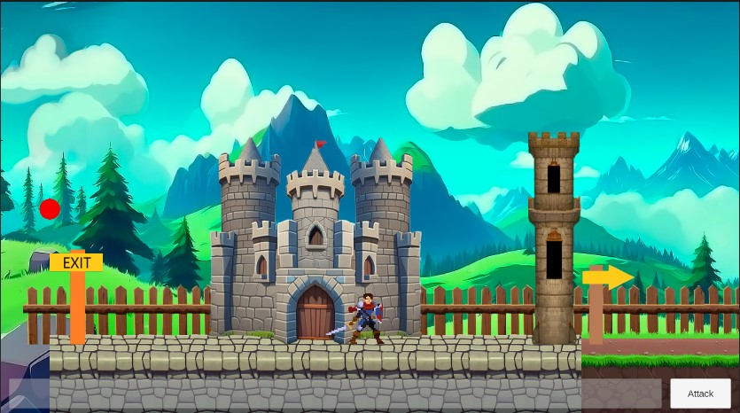
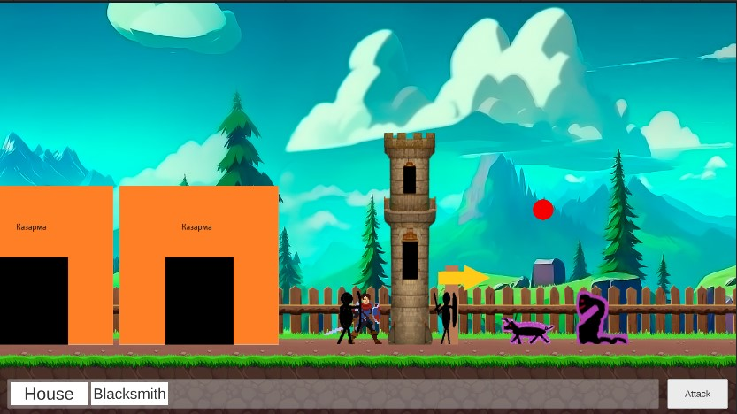
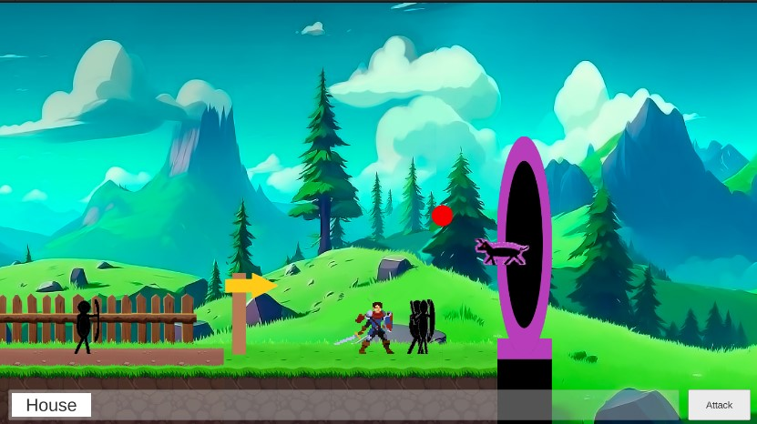
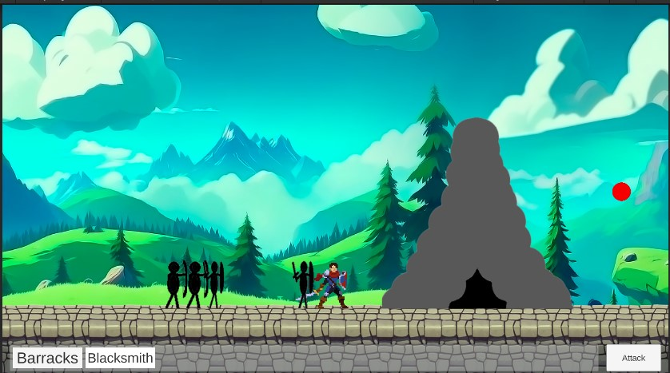

**English** | [🇷🇺 Русский](README_RU.md)

## Description:

A prototype for a 2D strategy game, conceptually similar to Kingdom Two Crowns and the Castle Fight custom map from Warcraft 3.

The game world, buildings, and units are loaded directly from XML files and can be fully configured without recompiling the project.

## Screenshots:

Player Base:

Battle (unit, building, and enemy models are placeholders!):

Portal to the Enemy Base:

Enemy Base:

## PC Build:

https://drive.google.com/file/d/1Hs4CMuwHO7b4uoivLoZ9GzyCOL0Q6Qr6/view?usp=sharing